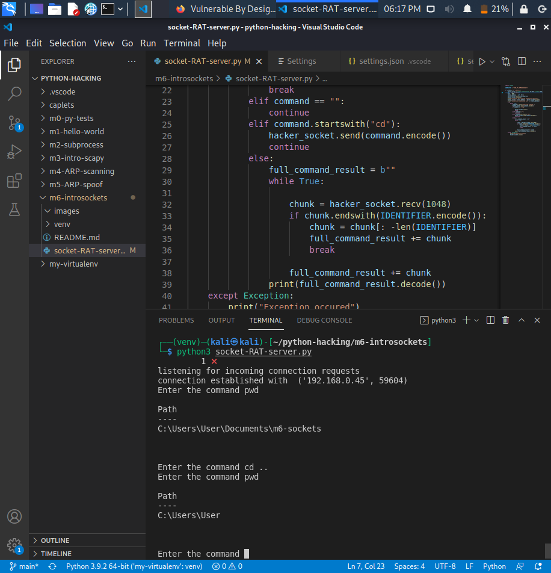

# pythonsocketRAT

## Python socket for Remote Access Tool (RAT)

Running commands remotely on the command line of another computer and navigate its directory.

Follow Chap.6 Malware Development of Python Ethical Hacking.

The image below shows the path was changed remotely:

